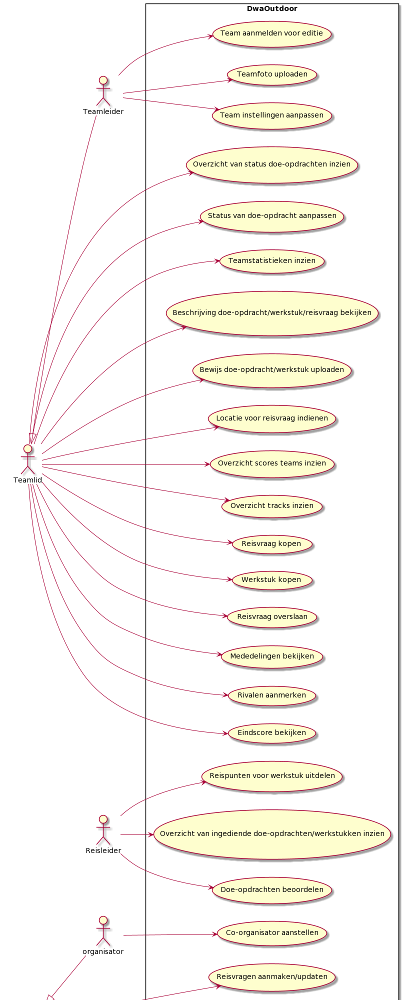

In dit hoofdstuk worden de belangrijkste functionaliteiten van de applicatie beschreven in de vorm van usecases. Eerst zal een diagram worden gegeven, met daarin een overzichtelijke weergave van de usecases en door welke actors deze uitgevoerd kunnen worden. Daarna zal op elke usecase kort dieper in worden gegaan.

### Functionaliteiten

<details><summary>Image preview</summary>


</details>

```puml
left to right direction
actor Teamleider as tl
actor Teamlid as t
actor Reisleider as r
actor organisator as o
actor coorganisator as co
actor admin as a
t <|-- tl
co <|-- o
rectangle DwaOutdoor {
    usecase "Team aanmelden voor editie" as UC1
    usecase "Overzicht van status doe-opdrachten inzien" as UC2
    usecase "Status van doe-opdracht aanpassen" as UC3
    usecase "Teamstatistieken inzien" as UC27
    usecase "Beschrijving doe-opdracht/werkstuk/reisvraag bekijken" as UC4
    usecase "Bewijs doe-opdracht/werkstuk uploaden" AS UC5
    usecase "Locatie voor reisvraag indienen" AS UC6
    usecase "Overzicht scores teams inzien" AS UC7
    usecase "Overzicht tracks inzien" AS UC8
    usecase "Reisvraag kopen" AS UC9
    usecase "Doe-opdrachten beoordelen" AS UC10
    usecase "Reispunten voor werkstuk uitdelen" AS UC11
    usecase "Overzicht van ingediende doe-opdrachten/werkstukken inzien" AS UC12
    usecase "Edities aanmaken/updaten" AS UC14
    usecase "Reisvragen aanmaken/updaten" AS UC15
    usecase "Doe-opdrachten aanmaken/updaten" AS UC16
    usecase "Teamfoto uploaden" AS UC17
    usecase "Werkstuk kopen" AS UC18
    usecase "Reisvraag overslaan" AS UC19
    usecase "Mededelingen bekijken" AS UC20
    usecase "Team instellingen aanpassen" AS UC21
    usecase "Rivalen aanmerken" AS UC22
    usecase "Admins aanstellen" AS UC23
    usecase "Reisleiding aanstellen" AS UC24
    usecase "Co-organisator aanstellen" AS UC25
    usecase "Werkstuk aanmaken/updaten" AS UC26
    usecase "Eindscore bekijken" AS UC28
}
tl --> UC1
t --> UC2
t --> UC3
t --> UC27
t --> UC4
t --> UC5
t --> UC6
t --> UC7
t --> UC8
t --> UC9
r --> UC10
r --> UC11
r --> UC12
a --> UC14
co --> UC15
co --> UC16
tl --> UC17
t --> UC18
t --> UC19
t --> UC20
tl --> UC21
t --> UC22
a --> UC23
co --> UC24
o --> UC25
co --> UC26
t --> UC28
```

In dit usecase diagram staan zes actoren. Vanuit elke actor staan pijlen getrokken naar de use cases die zij uitvoeren. Vanuit Teamleider is ook nog een pijl getrokken naar Teamlid. Dit houdt in, dat Teamleider een specialisatie van Teamlid is. Een Teamleider is een Teamlid en kan dezelfde usecases als een Teamlid uitvoeren, maar heeft nog extra usecases die hij kan uitvoeren die een normaal Teamlid niet kan uitvoeren. Dit is ook het geval bij Organisator en Co-organisator. Een Organisator kan dezelfde taken als een co-organisator uitvoeren, maar heeft ook nog extra usecases die alleen hij kan uitvoeren.

Hieronder staat voor elke usecase uit het diagram een korte toelichting met daarbij een link naar het bijbehorende schermontwerp.

##### Team aanmelden voor editie

Elk team dat mee wil doen aan een editie wijst één teamleider aan. De teamleider meld zijn team aan bij de editie door gegevens als organisatie naam, teamnaam, groepsgrootte en NAW-gegevens in te vullen.

- [Design aanmelden editie](../assets/JoinTheChallenge.png)

##### Teamfoto uploaden

Voordat een editie begint kan een teamleider voor zijn team een teamfoto uploaden. Deze foto is representatief voor het team en zal tijdens een editie onder andere zichtbaar voor reisleiding zichtbaar zijn bij het reviewen van ingediende doe-opdrachten en werkstukken.

##### Team instellingen aanpassen

Een teamleider kan voor en tijdens een editie instellingen aanpassen die betrekking hebben op welke acties teamleden kunnen uitvoeren tijdens een editie. Zo kan een teamleider instellen of teamleden ook werkstukken mogen kopen en of teamleden een PDF bestand mogen downloaden met daarin alle doe-opdrachten.

##### Overzicht van status doe-opdrachten inzien

Om de voortgang van alle doe-opdrachten voor een team inzichtelijk te maken, heeft elk team de beschikking over een taskbord waarop alle tasks real-time zichtbaar zijn. Deze tasks zijn geordend in kolommen die overeenkomen met de status van een task.

Het real-time component is hier belangrijk om het overzicht inzichtelijk en actueel voor de teams te houden. Dit is een belangrijke eis die de architectuur zal beïnvloeden.

- [Design overzicht doe-opdrachten](../assets/PraticalTasks.png)

##### Status van doe-opdracht aanpassen

Op het taskbord, waar elk team beschikking over heeft, kunnen teamleden, door een task te verplaatsen naar een andere kolom, de status van een task aanpassen. Deze geüpdate status zal real-time bij alle teamleden die het taskbord geopend hebben aangepast worden.

Het real-time component is hier belangrijk om duidelijkheid aan andere teamleden te bieden wat betreft de status van een taak. Dit is een belangrijke eis die de architectuur zal beïnvloeden.

- [Design overzicht doe-opdrachten](../assets/PraticalTasks.png)

##### Teamstatistieken inzien

Om inzicht te bieden in de voortgang en statistieken van het eigen team, heeft een teamlid toegang tot een pagina waar een overzicht van de statistieken van het team wordt weergegeven. Deze pagina geeft o.a. inzicht in het aantal reiscredits, aantal reispunten, aantal gebruikte bezembevers en de resterende speeltijd.

De verwachting is dat deze pagina, door een team, op een apart beeldscherm getoond zal worden en blijft gedurende de editie, om constant inzicht te hebben in de statistieken van het team. Hierom is het belangrijk om dit overzicht real-time te maken, zodat de teams te allen tijden duidelijk inzicht hebben in de voortgang. Dit is een belangrijke eis die de architectuur zal beïnvloeden.

- [Design overzicht voortgang team](../assets/TeamStats.png)

##### Beschrijving doe-opdracht/werkstuk/reisvraag bekijken

Als een teamlid op een doe-opdracht klikt vanuit het taskbord, komt het teamlid op de detail pagina van een doe-opdracht uit. Op deze pagina zijn een beschrijving van de doe-opdracht, de status van de doe-opdracht en de resultaten van het indienen van bewijs zichtbaar. Tevens is dit de pagina waarop bewijs geüpload kan worden.

- [Design beschrijving doe-opdracht](../assets/TaskDetails.png)

Als een teamlid op een reisvraag klikt vanuit het overzicht van de tracks, komt het teamlid op de detail pagina van een reisvraag uit. Op deze pagina zijn een beschrijving van de reisvraag, de status van de doe-opdracht en de resultaten van het indienen van locaties zichtbaar. Tevens is dit de pagina waarop een teamlid een locatie kan aanklikken op een kaart als antwoord op de reisvraag.

- [Design beschrijving reisvraag](../assets/LocationTask.png)

Als een teamlid op "projects" in het menu klikt, komt het teamlid op de detail pagina van een werkstuk uit. Op deze pagina zijn een beschrijving van het werkstuk, de status van de doe-opdracht en het resultaat van het indienen van het werkstuk zichtbaar. Tevens is dit de pagina waarop het gemaakte werkstuk ingediend kan worden.

##### Bewijs doe-opdracht/werkstuk uploaden

Wanneer een team bewijs heeft verzameld van een doe-opdracht in de vorm van foto's of video's of een werkstuk heeft gemaakt, kan een team de bestanden hiervan uploaden. Na het uploaden zijn de bestanden beschikbaar voor de reisleiding om deze te beoordelen.

Een groot deel van de verwachte load zal ontstaan door het uploaden van bewijs. Deze use-case zal een grote invloed hebben op de architectuur.

- [Design Bewijs uploaden](../assets/TaskDetails.png)

##### Locatie voor reisvraag indienen

Wanneer een team na aanleiding van de beschrijving van de reisvraag de correcte locatie denkt te hebben gevonden, kan een teamlid op een kaart de locatie aanklikken en deze indienen. Het applicatie controleert dan gelijk of de ingediende locatie binnen de veelhoek valt en geeft hiervan feedback aan het teamlid.

- [Design Locatie indienen](../assets/LocationTask.png)

##### Overzicht scores teams inzien

Tijdens een editie kunnen teamleden van een team via een overzicht inzien hoe hun rivalen en andere teams ervoor staan. Zo kunnen zij van andere teams de positie, reiscredits en reispunten inzien.

- [Design overzicht scores](../assets/Ranking.png)

##### Overzicht tracks inzien

Om de voortgang van de tracks voor een team inzichtelijk te maken, heeft elk team de beschikking over een pagina waarop de voortgang van alle tracks inzichtelijk is gemaakt. In dit overzicht kunnen teams van alle drie de tracks zien welke vragen voltooid zijn, welke vragen ingediend zijn en welke vragen overslagen zijn. Tevens kan een teamlid in dit overzicht nieuwe reisvragen kopen.

Het real-time component is hier belangrijk om het track overzicht inzichtelijk en actueel voor de teams te houden. Dit is een belangrijke eis die de architectuur zal beïnvloeden.

- [Design overzicht tracks](../assets/Tracks.png)

##### Reisvraag kopen

In het overzicht van de tracks heeft elk team de mogelijkheid om reisvragen te kopen. Kopen kan door op een witte knop te drukken met daarop het aantal travel credits dat de vraag kost. Waarna een reisvraag gekocht is, zal dit zichtbaar worden in het tracks overzicht en kan deze reisvraag beantwoord worden.

- [Design vragen/doe-opdrachten/werkstukken kopen](../assets/Tracks.png)

##### Werkstuk kopen

Tijdens een editie kan een teamleider of teamlid een werkstuk kopen. De teamleider of het teamlid heeft hierbij keuze tussen twee werkstukken waarvan alleen de namen zijn weergegeven. Zodra de teamleider of het teamlid een van de twee werkstukken heeft gekocht, kan het team meer informatie over het werkstuk inzien en het werkstuk gaan maken.

##### Reisvraag overslaan

Als een team tijdens een editie bij een reisvraag niet de correcte locatie kan achterhalen, kan een teamlid deze reisvraag op de detailpagina van de reisvraag overslaan. Het team verbruikt dan een bezembever. Op dat moment gaat ook een countdown lopen van 15 minuten. Pas na deze 15 minuten kan het team weer een andere reisvraag overslaan. Dit houdt dus in dat een bezembever maar een keer per 15 minuten door een team kan worden ingezet.

##### Mededelingen bekijken

Tijdens een editie kan een (co-)organisator een mededeling doen met betrekking tot de actieve editie. Een teamlid kan deze mededelingen bekijken op een pagina waarop alle mededelingen overzichtelijk worden weergegeven.

##### Rivalen aanmerken

Tijdens een editie kan een teamlid in het overzicht van de scores van andere teams een team aanmerken als rivaal. Dit team komt dan bovenin het overzicht te staan, zodat teamleden constant en makkelijk kunnen zien hoe de voortgang van hun rivalen is.

##### Eindscore bekijken

Als een editie is afgelopen hebben teamleden geen toegang meer tot het overzicht van de scores van andere teams. (Co-)organisatoren kunnen daarom nadat alle reviews gedaan zijn de eindscore publiceren. De teamleden kunnen na het publiceren de eindscore van de editie bekijken en zien op welke positie zij uiteindelijk geeindigd zijn.

##### Reispunten voor werkstuk uitdelen

Wanneer een reisleider op een ingediend werkstuk in het overzicht klikt, kan de reisleider het werkstuk keuren. Een reisleider kan hierbij de bestanden die geupload zijn door een team inzien en op basis hiervan reispunten aan een werkstuk uitdelen. De reisleider kan hierbij 1, 2, 4 of 6 reispunten aan het team uitdelen.

##### Overzicht van ingediende doe-opdrachten/werkstukken inzien

Tijdens een editie is het de taak van de reisleiders (juryleden) om ingediende doe-opdrachten en werkstukken te keuren. Reisleiders hebben daarom een overzicht van alle doe-opdrachten en werkstukken die ingediend worden door de teams. In dit overzicht kunnen juryleden zien welke task is ingediend, wat het type van een task is, door welk team deze task is ingediend, wat de status is van de task en wanneer deze ingediend is. Dit overzicht wordt real-time up-to-date gehouden.

- [Design Overzicht ingediende doe-opdrachten](../assets/SubmittedTasks.png)

##### Doe-opdrachten beoordelen

Wanneer een reisleider op een task in het overzicht klikt, kan de reisleider de doe-opdracht beoordelen. Een reisleider kan bij een doe-opdracht de filmpjes of foto's als bewijs bekijken en op basis hiervan de doe-opdracht goed- of afkeuren. Als de doe-opdracht wordt afgekeurd kan de reisleider hier nog een opmerking bijvoegen. Elke task mag maar door één reisleider tegelijk beoordeeld worden.

- [Design Tasks keuren](../assets/TaskReview.png)

##### Co-organisator aanstellen

Een organisator van een editie kan co-organisatoren aanstellen, zodat zij ook voor deze editie reisvragen, doe-opdrachten en werkstukken kunnen aanmaken en aanpassen. Een organisator kan co-organisatoren aanstellen door de gebruikersnaam van een gebruiker aan te klikken in een dropdown lijst en deze vervolgens toe te voegen. Ook kan een organisator zien welke gebruikers hij al als co-organisator heeft aangesteld.

##### Reisvragen aanmaken/updaten

Een (co-)organisator kan voor een editie begint, reisvragen aanmaken die teams tijdens een editie zullen krijgen. Een (co-)organisator vult hiervoor een omschrijving, het aantal credits dat een vraag kost en het aantal points dat een team krijgt als beloning in. Daarnaast kiest de (co-)organisator in welke track de vraag moet worden geplaatst. De correcte locatie kan een (co-)organisator invoeren door een veelhoek uit te zetten op een kaart. Een (co-)organisator kan ook kiezen om een bestaande reisvraag aan te passen.

##### Doe-opdrachten aanmaken/updaten

Een (co-)organisator kan voor een editie begint doe-opdrachten aanmaken die teams tijdens een editie kunnen uitvoeren. Een (co-)organisator vult hiervoor een titel, omschrijving en moeilijkheid in en geeft aan hoeveel credits een team als beloning krijgt. Daarnaast geeft een (co-)organisator aan of de vraag direct gepubliceerd moet worden. Een (co-)organisator kan ook kiezen om een bestaande reisvraag aan te passen. 

Tijdens een actieve editie kan een (co-)organisator ook nieuwe doe-opdrachten toevoegen. Deze worden dan niet direct gepubliceerd voor teams. Wanneer een (co-)organisator heeft aangevinkt welke nieuwe doe-opdrachten gepubliceerd moeten worden en op "publish" drukt, worden de nieuwe doe-opdrachten wel vrijgegeven voor teams.

##### Reisleiding aanstellen

Een organisator van een editie kan reisleiders aanstellen, zij kunnen tijdens een editie doe-opdrachten en werkstukken reviewen. Een organisator kan reisleiding aanstellen door de gebruikersnaam van een gebruiker aan te klikken in een dropdown lijst en deze vervolgens toe te voegen. Ook kan een organisator zien welke gebruikers hij al als reisleiding heeft aangesteld.


##### Werkstuk aanmaken/updaten

Een (co-)organisator kan voor een editie begint werkstukken aanmaken die teams tijdens een editie kunnen uitvoeren. Een (co-)organisator vult hiervoor een titel en omschrijving in. Een (co-)organisator kan ook kiezen om een bestaand werkstuk aan te passen. 

##### Edities aanmaken/updaten

Een admin kan edities aanmaken. Een admin vult hiervoor de startdatum en einddatum van de editie in. Daarnaast geeft een admin aan of de editie open staat voor inschrijvingen van teams. Een admin of de organisator van de editie kunnen ook kiezen om de start- en einddatum aan te passen en aan te passen of de editie open staat voor inschrijvingen.

##### Admins aanstellen

Een admin kan ervoor kiezen om andere admins aan te stellen. Deze nieuwe admins kunnen vervolgens ook edities aanmaken. Een admin kan andere admins aanstellen door de gebruikersnaam van een gebruiker aan te klikken in een dropdown lijst en deze vervolgens toe te voegen. Ook kan een admin zien welke andere admins zijn aangesteld.
