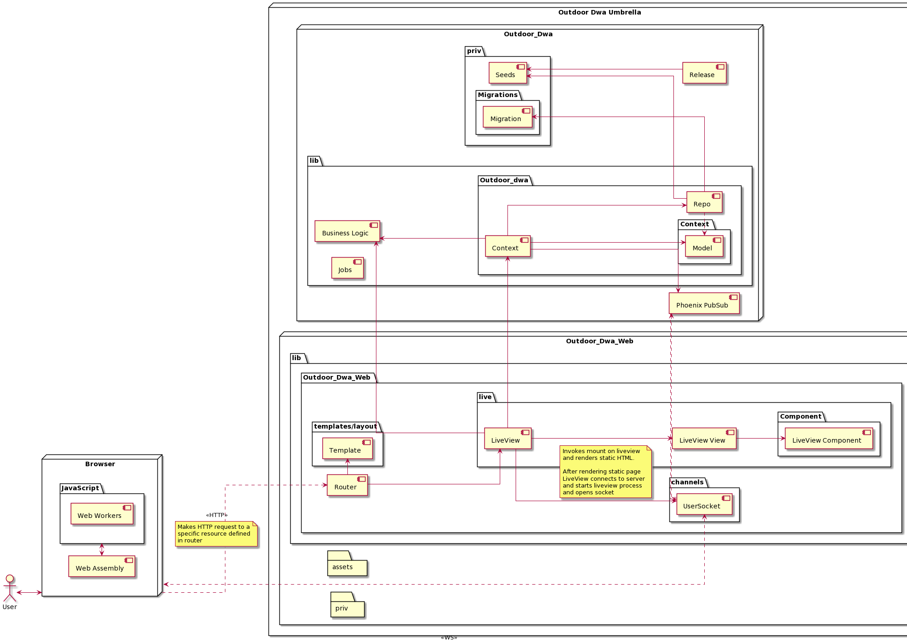
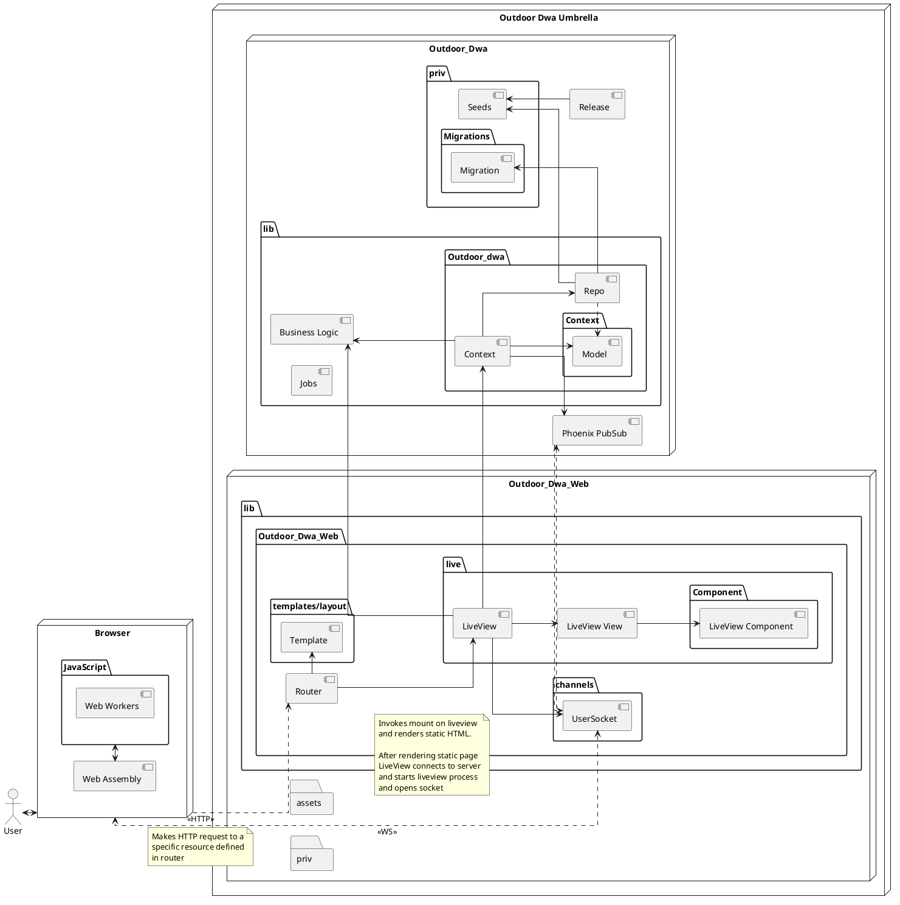

Dit hoofdstuk zal een high level overview van de software architectuur bevatten. De high level overview wordt besproken aan de hand van een container diagram, vervolgens worden de verschillende elementen uit het container diagram toegelicht in de vorm van een tabel. Hierbij wordt er gekeken naar de functie van een component, en verder wordt er ook gekeken welke design patterns, of raaklijnen met bekende design patterns aanwezig zijn in deze container.

#### Component Diagram

Om inzicht te bieden in het high-level overview van de architectuur, wordt hieronder een component diagram getoond. Dit diagram geeft de verschillende componenten waaruit de applicatie is opgebouwd weer. Elk component heeft zijn eigen verantwoordelijkheid, en kan afhankelijk zijn van andere componenten. Dit diagram kan gebruikt worden om kennis te krijgen van de globale opbouw van de applicatie. Dit is handig wanneer de developer zich afvraagt waar hij bestaande functionaliteit kan vinden, en waar hij nieuwe functionaliteit moet plaatsen.

Image preview

In dit diagram zijn een aantal belangrijke processen binnen de applicatie weergeven. Er wordt in dit stuk tekst een verdere toelichting gegeven op een aantal relaties die belangrijk worden geacht.

##### Browser - Router

De relatie tussen de browser en router werkt als volgt. De gebruiker maakt een HTTP request naar de applicatie. De router pakt dit op, en kijkt welke resource er wordt opgevraagd. Het genereert op basis van de template en de liveview een HTML pagina, en returned deze statische pagina. Nadat dit is gebeurt wordt er een liveview process gestart, en wordt de websocket connectie opgezet waardoor de gebruiker updates kan ontvangen via het PubSub systeem.

##### UserSocket - Phoenix PubSub

Wanneer er een websocket connectie wordt aangemaakt, meldt de websocket zich aan op een bepaald topic. Wanneer er updates op dit topic worden gebroadcast vanaf de context, dan ontvangen alle clients die zich op dit topic hebben aangemeld een update. Dit wordt door Phoenix PubSub ondersteund. PubSub levert functionaliteit om de informatie aan verschillende instanties van phoenix door te geven. Op deze manier kunnen de updates over verschillende servers gebroadcast worden, en worden alle clients van de servers geïnformeerd. Verder wordt alleen de veranderde data doorgegeven. Op deze manier update LiveView op een efficiënte manier de pagina's.

##### LiveView View - LiveView Component

LiveView views kunnen worden opgebouwt vanuit componenten. Op deze manier is het mogelijk om statefull, of stateless componenten te maken, die je binnen alle liveviews kunt herbruiken. Deze worden als het ware binnen de view gerendered en hebben geen eigen liveview process.

##### Context - Repo

In de Context staan de functies verwerkt die gebruikt kunnen worden om data uit de repository te halen. Hiervoor wordt er gebruik gemaakt van functionaliteit die in het Repo component staat. Hierbij wordt er een model meegegeven. Dit model zorgt voor de vertaling tussen de Database en Elixir (op basis van het Schema).

#### Toelichting Componenten

Binnen deze paragraaf worden de verschillende componenten voorzien van een toelichting. Dit wordt gedaan aan de hand van een tabel.

| Component          | Toelichting                                                                                                                                                                                                                                                                                                                                                                                    |
| ------------------ | ---------------------------------------------------------------------------------------------------------------------------------------------------------------------------------------------------------------------------------------------------------------------------------------------------------------------------------------------------------------------------------------------- |
| Router             | De router is verantwoordelijk voor het verwerken van HTTP requests. Het mapt een verzoek van de gebruiker naar een specifieke resource binnen het systeem.                                                                                                                                                                                                                                     |
| Template           | In het template component staat het "skelet" van de HTML. Dit component levert een HTML pagina, en binnen deze pagina wordt de opgevraagde view gerenderd.                                                                                                                                                                                                                                     |
| LiveView           | Een Phoenix LiveView. Dit stelt de applicatie in staat om real-time updates van de state aan de gebruiker te tonen. Elke "pagina" heeft zijn eigen LiveView. Voorbeelden zijn de homepage, de pagina om een account te registreren, en de pagina die informatie over een doe-opdracht weergeeft.                                                                                                   |
| LiveView View      | Het component dat verantwoordelijk is voor de visuele weergave van een liveview. Deze componenten hebben dezelfde naam als de LiveView waar ze bij horen. Een voorbeeld van de LiveView View van "task_overview_live.ex" (de LiveView voor het overzicht van de taken) is "task_overview_live.html.leex".                                                                                      |
| LiveView Component | Een component wat door een LiveView View gerenderd kan worden. LiveView componenten kunnen statefull, of stateless zijn. Deze kunnen binnen meerdere LiveViews herbruikt worden                                                                                                                                                                                                                |
| UserSocket         | Het component wat verantwoordelijk is voor het werken met de websocket.                                                                                                                                                                                                                                                                                                                        |
| Business Logic     | Dit component bevat de business logic. In de applicatie heet het bijbehorende bestand "outdoor_dwa.ex". Gedurende het project is het waarschijnlijk dat de opbouw hiervan gaat veranderen.                                                                                                                                                                                                     |
| Context            | Een "context" module om gerelateerde functionaliteit te groeperen. Binnen een context wordt er gebruik gemaakt van een of meerdere models. Deze context voorziet de applicatie van het Data Access Object pattern, en kan via de repo context-specifieke data ophalen en aanpassen.                                                                                                            |
| Seeds              | De voorbeelddata die gebruikt wordt in de development omgeving van de applicatie. In dit component kan je een groot populatiescript vinden wat wordt gebruikt om de database van voorbeeld-data te voorzien                                                                                                                                                                                    |
| Migration          | Een migratie-bestand. Dit component is verantwoordelijk voor het toepassen van de nodige DDL. Het maakt de juiste tabellen in de database, legt de juiste relaties en constraints e.d..                                                                                                                                                                                                        |
| Repo               | Dit component is verantwoordelijk voor de koppeling tussen de database en de applicatie. Ook wordt het repository pattern hier toegepast, waardoor er gemakkelijk tussen database-provider gewisseld kan worden (mits het door Phoenix/Ecto wordt ondersteund.)                                                                                                                                |
| Model              | Een specifiek model. Dit model is de representatie van data binnen elixir. Dit model bevat twee belangrijke onderdelen, een schema definitie, en een functie voor het maken van een changeset. Zo bevat het User model bijvoorbeeld een User Schema (wat een "adapter" tussen de repository en elixir is), en een changeset functie, die kijkt of alle velden aan de opgestelde eisen voldoen. |
| Phoenix PubSub     | Het PubSub systeem van Phoenix. Dit component maakt het mogelijk updates van één specifieke cliënt aan alle andere cliënts die op een bepaald topic zijn gesubscribed door te geven. Hier wordt binnen LiveView gebruik van gemaakt om de updates aan de state door te geven.                                                                                                                  |
| Web Assembly       | Is verantwoordelijk voor het uitvoeren van taken waarvoor geen native javascript libraries beschikbaar zijn, of performance cruciaal is. Web Assembly draait niet op de main thread.                                                                                                                                                                                                           |
| Web Workers        | Zorgt ervoor dat javascript op meerdere threads wordt uitgevoerd, wordt gebruikt om te voorkomen dat javascript code de main thread blokkeert.                                                                                                                                                                                                                                                 |
| Release            | Runt wanneer de applicatie wordt gestart in een container. Zorgt ervoor dat migrations worden uitgevoerd en kan de seeds draaien.                                                                                                                                                                                                                                                              |
| Jobs               | Taken die kunnen worden gescheduled om op een bepaald tijdstip, eventueel in een rimte, uitgevoerd te worden. Is bijvoorbeeld verantwoordelijk om elk team elke 30 minuten 1 reiscredit te geven. Deze jobs worden door [Oban](https://github.com/sorentwo/oban) uitgevoerd.                                                                                                           |
