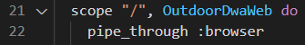
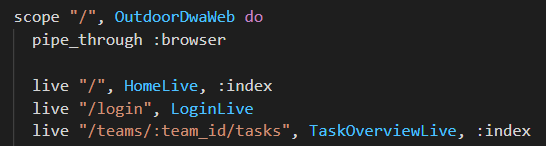
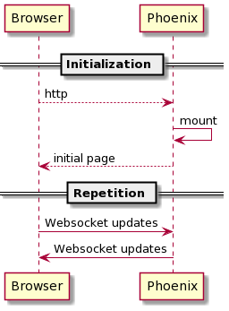
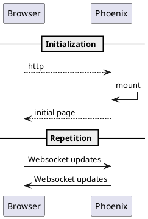
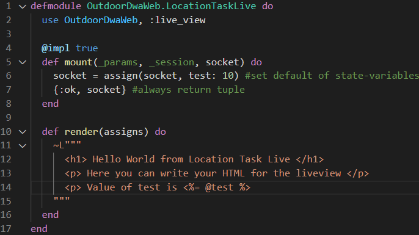
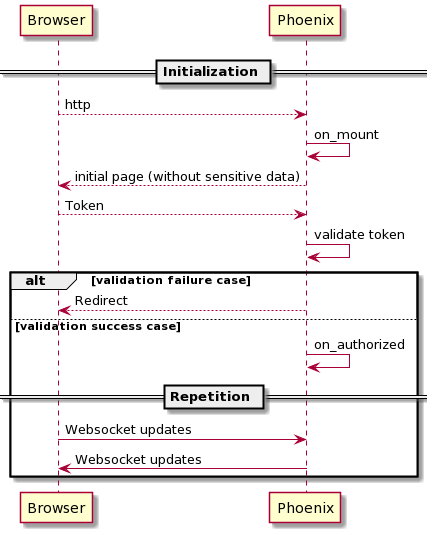
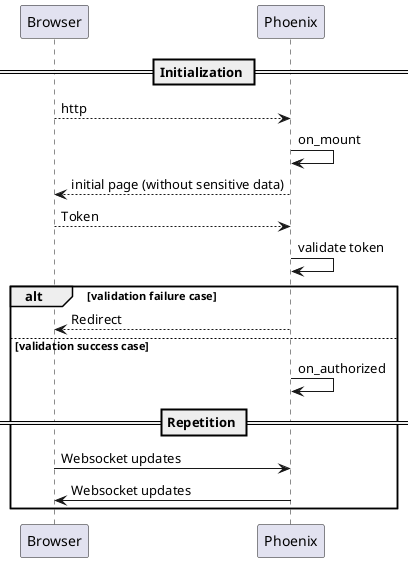
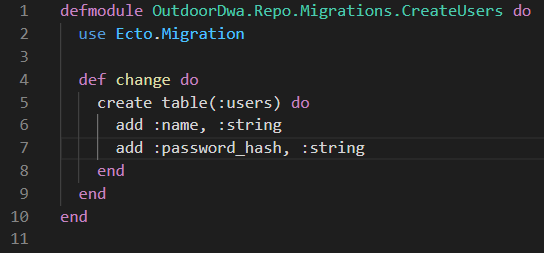
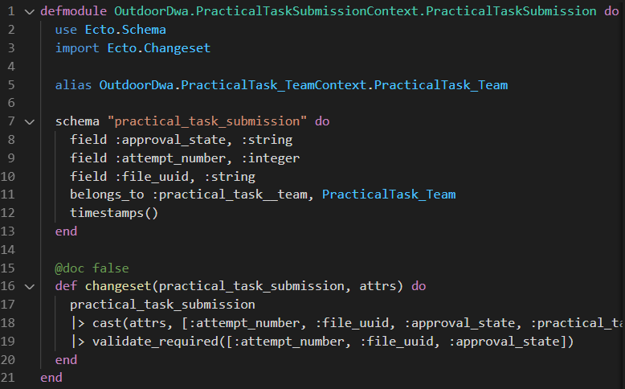

# Code

Dit hoofdstuk is bedoeld om developers die nieuw in het project komen een vliegende start te geven in de structuur van
de code. In sommige paragrafen ligt de focus op een toelichting van de code, en in sommige paragrafen ligt de focus op het introduceren van nieuwe functionaliteit.

## Routing

Wanneer je via de browser een url probeert te benaderen, dan wordt er een request gestuurd naar de service die op dat adres draait (bijv. een phoenix applicatie op http://localhost:4000). Dit request bestaat uit een 'path', en een 'verb'. Binnen een Phoenix applicatie wordt deze combinatie van path en verb gebruikt om een gebruiker naar de juiste actie binnen de applicatie te verwijzen.

In een typische Phoenix applicatie worden deze requests afgehandeld in de "Router". Deze router is te vinden in het OutdoorDwaWeb project, in de folder lib. Binnen dit project is er een scope voor het OutdoorDwaWeb gedefinieërd



Requests die op de '/' matchen, zullen de scope doorlopen. Het eerste wat in deze scope gebeurt is dat het request in de browser pipeline wordt gepiped. Hierbinnen vinden er een aantal transformaties plaats op het request die voor elk request uitgevoerd moeten worden. Zo worden er in deze pipeline bijvoorbeeld session-informatie opgehaald, en de root layout wordt opgehaald. Vervolgens wordt er in de scope gekeken of er een exacte match is. Wanneer dit het geval is, wordt de bijbehorende actie uitgevoerd.

Om een route toe te voegen aan de applicatie hoef je enkel een nieuwe route te definiëren, en binnen de scope toe te voegen. Hieronder volgen een aantal voorbeelden.



Met live wordt aangegeven dat de nieuwe route voor een liveview is. De route is de opvolgende string ("/login", "/teams/:team_id/tasks"). Wanneer iets wordt geprefixed door een ":" dan is dit een parameter die beschikbaar wordt gesteld. (:team_id wordt bijv. in de url vervangen met een daadwerkelijk ID, zoals 4).

Na het path, volgt de live-view die aan dit path is gekoppeld. Zo kunnen op basis van de bovenstaande routes bijvoorbeeld de homepage, loginpage, of de task overview page benaderd worden.

## Phoenix Live View

In dit project wordt [Phoenix Live View](https://hexdocs.pm/phoenix_live_view/Phoenix.LiveView.html) gebruikt en
wordt ["normaal" Phoenix](https://hexdocs.pm/phoenix/overview.html) vermeden.

Dit is gedaan, omdat bijna alle pagina's live updates moeten laten zien. Bovendien wordt er op de manier minder last
ondervonden van de subtiele verschillen in helper functies. Door live view is er zelden een situatie dat het nodig is om
javascript te schrijven, hierdoor kun je dus alle server side code hergebruiken 'op de client'.

Het volgende diagram laat zien hoe een onbeveiligde pagina wordt geladen.

<details><summary>Image preview</summary>


</details>



### LiveView cookbook

Om een nieuwe liveview te maken moeten er twee stappen uitgevoerd worden. Allereerst moet er een route worden aangemaakt waarmee de liveview te benaderen is. Vervolgens moet de liveview aangemaakt worden.

Een basis liveview is heel simpel opgebouwd. De belangrijke onderdelen zijn het using statement op regel 2, de mount functie op regel 5 en de render functie op regel 10.

Met het using statement geef je aan dat het een LiveView is. In de mount functie plaats je de code die nodig is bij het initialiseren van de liveview (bijv. assignen van belangrijke variabelen), en in de render functie geef je aan hoe de live-view aan de gebruiker wordt getoont. De render functie kan ook vervangen worden door een bestand waarin je de HTML plaatst. Hierbij is het belangrijk dat je het bestand de juiste naam geeft. Dit wordt op basis van de module naam gematched bij de juiste liveview. In onderstaand geval is de juiste bestandsnaam "location_task_live.html.leex"

Binnen OutdoorDwa zijn de liveviews iets anders opgebouwd in verband met de authorisatie. Hier is meer over te lezen in de paragraaf "AuthenticatedLive"



### OTP-like features van Phoenix Live View

Live view controllers wrappen GenServer calls in twee callbacks wij gebruiken: `handle_info/2` en `handle_event/3`
Beide callbacks krijgen de socket die op dat moment verbonden is aan de GenServer.

`handle_event` wordt getriggert na websocket berichten vanuit de client, terwijl `handle_info` wordt getriggert door
berichten te sturen naar de GenServer door `send()` of PubSub.

Omdat alles van een Live View in hetzelfde process draait, kun je handle_info gebruiken om iets uit te voeren nadat de
huidige functie voorbij is, dis kan worden gebruikt om twee acties op een socket uit te voeren die anders met elkaar
zouden botsen, zoals een `push_event` en een redirect. Dit kan doordat messages voor een process in een queue worden
gezet.

```elixir
defp set_token_and_redirect(socket, session_info, to) do
  result = AuthHelpers.send_token(socket, session_info)
  send self(), {:redirect, get_redirection(socket, to)}
  result
end

@impl true
def handle_info({:redirect, to}, socket) do
  {:noreply, push_redirect(socket, to: to)}
end
```

#### Distributed live client updates

Omdat clients op verschillende phoenix servers kunnen verbinden door de horizontale schaling is het belangrijk dat alle
clients live updates krijgen van alle servers, niet alleen van de server waar de client mee verbonden is. Dit wordt bereikt met [Phoenix.PubSub](https://hexdocs.pm/phoenix_pubsub/Phoenix.PubSub.html)

Broadcasts worden **per definitie** vanuit een context gedaan, dit zorgt ervoor dat alle servers altijd kunnen subscriben op alle mutaties.

```elixir
defp specific_broadcast(practical_task_submission, event) do
    Phoenix.PubSub.broadcast(
      OutdoorDwa.PubSub,
      "#{@topic}:#{practical_task_submission.practical_task__team_id}",
      {event, practical_task_submission}
    )
  end
```

#### Let it crash

Wanneer input als vijandig of als onverwacht wordt beschouwd, wordt hier geen complexe validatie logica voor
geschreven, crash betreffende GenServer in dit geval. Dit is vaak eenvoudiger, omdat er minder edge cases hoeven te
worden gevalideerd. Bij dit soort inputs is een error pagina 9 van de 10 keer goed genoeg. Omdat processen geïsoleerd
zijn en automatisch opnieuw worden opgestart zal dit op andere gebruikers geen invloed hebben.

## AuthenticatedLive

Voor pagina's waarvoor moet worden ingelogd, wordt gebruikt gemaakt van de custom AuthenticatedLive module, deze module
zorgt ervoor dat de request live cycle er als volgt uitziet:

<details><summary>Image preview</summary>


</details>



Om AuthenticateLive te gebruiken moet een regel zoals:

```elixir
use OutdoorDwaWeb, :live_view
```

Worden vervangen met, waarbij het tweede element van de tuple de rol is waaraan voldaan moet worden

```elixir
 use OutdoorDwaWeb, {:live_view_auth, :is_team_member}
```

Daarnaast moet de `mount/3` worden vervangen met `on_mount/3`, let op, tijdens de mount is de socket nog niet
geauthenticeerd en mag er dus geen gevoelige informatie worden geassignt, hiervoor is de `on_authorzed/1`
_Let op:_ AuthenticateLive past niet automatisch authenticatie toe op de callbacks `handle_event` en `handle_info`
calls.

Code in deze callbacks worden gewrapt in een authorized block:

```elixir
@impl true
def handle_event("event", _params, socket) do
  authorized socket do
    {:noreply, socket}
  end
end
```

## Layers

Er worden twee layers gebruikt, de interactie laag (outdoor_dwa_web) en de domain laag (outdoor_dwa). Op deze manier is
in theorie de complete UI herschrijfbaar naar een ander platform, zonder dat daarvoor business logica en database
interactie aangepast hoeft te worden.

## Database communication

Voor database communicatie wordt [ecto](https://hexdocs.pm/ecto/Ecto.html) gebruikt. Om de koppeling tussen de database en de applicatie goed te laten verlopen, zijn de modellen op een speciale manier opgebouwd. Het deel wat relevant is voor de database zijn de "Migration Files". Deze zijn te vinden in het OutdoorDwa project, in de folder "priv". Deze migrations zijn verantwoordelijk voor het in stand brengen van de database. Het is belangrijk om de migrations te genereren met een command, omdat ze op basis van de timestamp voor de naam worden uitgevoerd.

```
mix ecto.gen.migration add_weather_table
```

Op deze manier worden de tabellen en relaties altijd in dezelfde volgorde aangemaakt. Hieronder is een voorbeeld te zien van een migration file voor het aanmaken van de "users" tabel.



Via migrations kan de juiste data dus in de database opgeslagen worden. Echter kan deze data niet zomaar naar een format vertaald worden wat voor elixir te begrijpen is. Hiervoor moeten er schemas voor de modellen aangemaakt worden. De onderstaande afbeelding toont een voorbeeld van een schema, met bijbehorende changeset functie. Binnen dit schema worden de database-velden, en relaties vertaald naar een datastructuur die bruikbaar is voor elixir. In dit voorbeeld levert het de "PracticalTaskSubmission"-struct op. Dit model levert de koppeling tussen elixir en de database.

De changeset functie biedt de mogelijkheid om data te filteren, casten, valideren en om constraints aan structs te stellen. Deze functie wordt veel gebruikt in de context, en binnen formulieren voor data-validatie (bijv. berichtgeving aan gebruiker bij foute invoer). Hier is meer over te lezen in de [hexdocs](https://hexdocs.pm/ecto/Ecto.Changeset.html).



## Folder structure

Voor elke layer is er een folder, daarna worden er eerst folders aangemaakt zoals `mix phx.new` dit doet. Binnen
de live folder worden er folders gemaakt voor elke live view controller en zijn template. Gedeelde components zitten in
de component folder, terwijl one-off components bij hun parent in de folder zitten. Grote groepen bij elkaar horende
pagina's, zoals het admin gedeelte worden ook in een folder geplaatst. Hiernaast worden groepen van helper modules in
eigen folders gezet een niveau boven de live folder.

## Pitfalls

Een ongedocumenteerd 'feature' van phoenix is het feit dat `live_upload` niet goed werkt wanneer het gebruikt wordt in een component.
Dit zal dus altijd in een live view moeten staan.

## Client

### Styling 

Voor styling wordt er gebruik gemaakt van [tailwindcss](https://tailwindcss.com/), dit is een utility framework wat inhoudt dat er veel css classes worden geleverd die kleine styling rules regelen, bijvoorbeeld padding of background color. 
Tailwindcss biedt geen components (bijvoorbeeld een card of dropdown) aan zoals bootstrap wel doet. Tailwind wordt gebruikt vanwege de grote flexibiliteit die het levert. 

We hebben de voorkeur om tailwind classes die samen een component vormen te wrappen in een eigen scss bestand, bijvoorbeeld [_button](../../outdoor_dwa_umbrella/apps/outdoor_dwa_web/assets/css/components/_button.scss).
Dit wordt gedaan om code duplicatie te voorkomen en zorgt ervoor dat styling wijzigingen in één keer in de hele applicatie doorgevoerd kunnen worden.
Hiervoor wordt `@apply` gebruikt, dit komt uit de preprocessor, dit houdt in dat alle classes in de lijst worden toegevoegd aan de betreffende class:
```scss
.button {
  background-color: rgba(0, 0, 0, 1);
  color: rgba(255, 255, 255, 1);
}
```
Is gelijk aan:
```scss
.button {
  @apply bg-black text-white;
}
```

Om [BEM](getbem.com/introduction/) te gebruiken wordt er gebruik gemaakt van de [scss ampersand syntax](./05-principles.md#client).

### Javascript

Code wordt zoveel mogelijk serverside geschreven, maar er zijn gevallen waarbij het onvermijdelijk of veel handiger is om client side code te schrijven.
Voorbeelden hiervan zijn het opslaan en versturen van de autorisatie token en file parsing.

Javascript code moet in principe altijd door de server worden getriggert, anders kun je niet weten of de client wel op de live view zit die je verwacht.
Een mogelijkheid die we afraden is het opnemen van script tags in een live view. Dit maakt het herleiden van client side code ingewikkelder en het is lastiger om externe dependecies te gebruiken.
In plaats hiervan kun je Phoenix een `phx-hook` html attribuut laten sturen en in javascript een listener hievoor installeren, de volgende code laat zien hoe je eenmalig, na het navigeren naar een live view javascipt code triggered.

```html
<!-- Server -->
<div phx-hook="Authenticate" id="authenticate" style="display: none;"></div>
```
```js
// Client
Hooks.Authenticate = {
    mounted() {
        const token = localStorage.getItem("token");
        this.pushEvent("AuthenticateToken", {token});
    }
}
```
De documentatie van Phoenix over [JavaScript interop](https://hexdocs.pm/phoenix_live_view/js-interop.html) beschrijft welke fasen de hooks doorlopen.

Wanneer je javascript code vaker wilt kunnen triggeren kun je vanuit LiveView `push_event` gebruiken, javascript moet dan wel eerst een listener hebben geïnstalleerd:
```elixir
# Server
def send_token(socket, session_info) do
  token = sign(session_info)
  {:noreply, LiveView.push_event(socket, "token", %{token: token, role: session_info.role})}
end
```
```html
<!-- Server -->
<main role="main" phx-hook="Token" id="main" class="container px-6 mx-auto">
```
```js
// Client
Hooks.Token = {
    mounted() {
        this.handleEvent("token", ({token, role}) => {
            localStorage.setItem("token", token)
            localStorage.setItem("role", role)

            window.topics.broadcast('authStateChanged');
        });
    }
};
```

#### Checken bestand metadata

Voor het checken of een bestand is gemaakt tijdens de editie wordt gebruik gemaakt van metadata die in bestanden staat, voor foto's zijn dit onder andere EXIF- en XMP-standaarden, MP4 heeft dit in de standaard beschreven.
Omdat voor het uitlezen van deze metadata de bestanden moeten worden geparst worden hier externe depencies gebruikt.
Het nadeel hiervan is dat de dependencies toegang moeten hebben tot de binary representatie van de bestanden en dat dit trage operaties zijn.
Het eerste probleem hiervan wordt opgelost om een proxy (nginx) caching headers te laten toevoegen aan de MinIO requests, hierdoor kan er een fetch worden gedaan die uit de browser cache leest.
Het tweede probleem wordt voor foto's anders opgelost dan voor video's. 

##### Foto's

Voor foto's wordt de library [exifreader](https://www.npmjs.com/package/exifreader) gebruikt, die in een WebWorker wordt uitgevoerd. 
[Exif.js](https://github.com/exif-js/exif-js) is ook overwogen, maar doordat de voorbeelden in de documentatie niet werkte en het minder compleet lijkt te zijn dan exifreader, is exifreader uiteindelijk gekozen. 

Doordat de WebWorker een vergelijkbaar concurrency model gebruikt als Elixir ([shared nothing, message passing](https://developer.mozilla.org/en-US/docs/Web/API/Web_Workers_API/Using_web_workers)), is dit een expliciete manier om javascript code in een andere thread uit te voeren en zo te voorkomen dat de main thread geblokkeerd wordt.
De volgende code laat zien hoe je een webworker kunt aanmaken, belangrijk hierbij is de `.worker.js` bestandsnaam, vanwege de [webpack loader](https://webpack.js.org/loaders/worker-loader/).
```js
// example.worker.js
onmessage = ({data}) => { // Executed when the worker receives a message
    // Do stuff
    postMessage('a custom response');
}
// Caller:
import Worker from './example.worker.js';
worker = new Worker();
worker.onmessage = ({data}) => {
    // Process result
}
worker.postMessage('input'); // Send a message to the worker
```

##### Videos

Voor videos wordt [ffmpeg.wasm](https://github.com/ffmpegwasm/ffmpeg.wasm) gebruikt, dit is een port van een CLI tool die allerlei bewerkingen kan doen op diverse bestandstypen.
Ffmpeg.wasm is waarschijnlijk overkill voor dit project, het is vooral gemaakt voor conversies en niet echt voor het lezen van metadate. Maar de [mp4box.js](https://github.com/gpac/mp4box.js/) library werkte niet goed. Ffmpeg was bovendien eerst te testen op de terminal.
Zoals aan de naam van ffmpeg.wasm te zien is dit een web assembly, dit houdt in dat oorspronkelijk in een andere taal is geschreven (web assembly is een compilation target) en dat het niet op de main thread wordt uitgevoerd.

Ffmpeg.wasm biedt een kleine complexiteit in het feit dat het zijn eigen geissoleerde memory file system gebruikt, bestanden die verwerkt moeten worden moeten eerst naar dat file system worden geschreven en resultaten moeten hiervan af worden gelezen:
```js
ffmpeg.FS('writeFile', name, file);
ffmpeg.FS('readeFile', name);
```