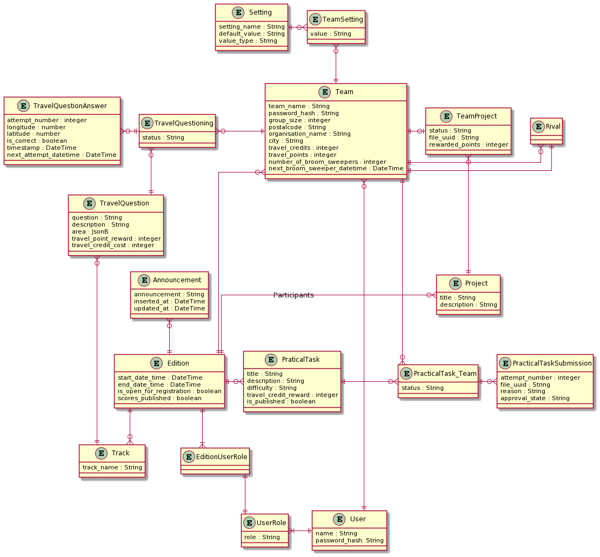
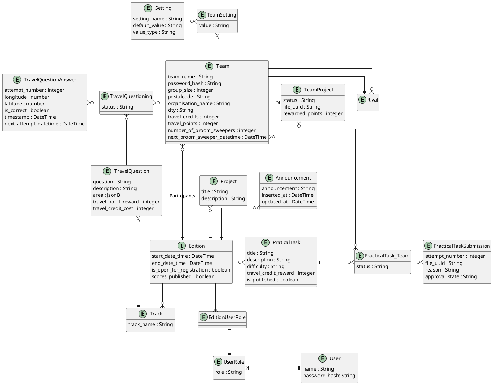

# Data

In dit hoofdstuk is informatie te vinden over het informatiemodel.
Dit kan gebruikt worden om inzicht te krijgen welke data er wordt opgeslagen binnen het OutdoorDWA project.

## Waar wordt data opgeslagen

De gegevens in het komende ERD worden opgeslagen in Postgres. Hiernaast is er een minio object store voor de in te leveren bestanden.
PDFs met doe-opdrachten die teams kunnen downloaden worden opgeslagen op het filesysteem van de phoenix server. Elke server zal dus een pdf genereren wanneer dit nodig is. De PDF's die voor het testen van de library zijn aangemaakt waren maar 4 kB groot, wat verwaarloosbaar is. Hierom is ervoor gekozen om ze te genereren indien nodig, en ze als static bestanden beschikbaar te stellen, in plaats van via bijv. MinIO.
Dit zorgt er bovendien voor dat, wanneer de minio cluster problemen ondervindt, de teams nog steeds door kunnen werken en alleen hoeven te wachten met inleveren.

## ERD

Het volgende model laat het ERD zien, dit weergeeft de relaties tussen de entiteiten die voor OutdoorDwa van belang zijn.

Image preview

## Entiteit beschrijvingen

Hier is een tabel te vinden waarin een korte beschrijving van alle entiteiten staat.

| Entiteit                | Beschrijving                                                                                                                                                                                                                                                                                                                                                             |
| ----------------------- | ------------------------------------------------------------------------------------------------------------------------------------------------------------------------------------------------------------------------------------------------------------------------------------------------------------------------------------------------------------------------ |
| Team                    | De algemene inloggegevens van alle deelnemers in een team en de scoreinformatie.                                                                                                                                                                                                                                                                                         |
| Rival                   | Teams die elkaar graag uitdagen, en elkaars score willen kunnen zien.                                                                                                                                                                                                                                                                                                    |
| Edition                 | Een uitvoeren van OutdoorDwa, waarvoor teams zich kunnen aanmelden en de organisator reisvragen kan toevoegen.                                                                                                                                                                                                                                                           |
| PracticalTask           | Een doe-opdracht, waarvoor een foto of filmpje wordt ingeleverd door een team.                                                                                                                                                                                                                                                                                           |
| PracticalTaskSubmission | Een inlevering van een team voor een bepaalde doe-opdracht binnen een editie. File_uuid verwijst naar een bestand in de minio object store.                                                                                                                                                                                                                              |
| User                    | Iemand die kan inloggen in OutdoorDwa.                                                                                                                                                                                                                                                                                                                                   |
| UserRole                | De rol van een gebruiker (organisator, reisleiding of teamleider).                                                                                                                                                                                                                                                                                                       |
| EditionuserRole         | De rol van een gebruiker gekoppelt aan een specifieke editie.                                                                                                                                                                                                                                                                                                            |
| Track                   | Een serie vragen binnen een editie.                                                                                                                                                                                                                                                                                                                                      |
| TravelQuestion          | Een vraag binnen een track, waarvan het antwoord een locatie is. Deze worden gekocht door middel van reiscredits.                                                                                                                                                                                                                                                        |
| TravelQuestionAnswer    | Een antwoord op een reisvraag door bepaald team.                                                                                                                                                                                                                                                                                                                         |
| TravelQuestioning       | Een instantie van een reisvraag voor één specifiek team. Het team geeft hun antwoorden op deze instantie.                                                                                                                                                                                                                                                                |
| PracticalTask_Team      | Een instantie van de doe-opdracht aan één specifiek team. Het team geeft hun antwoorden op deze instantie.                                                                                                                                                                                                                                                               |
| Setting                 | Een team-onspecifieke instatie van een setting. Deze entiteit bevat het datatype van de setting (wordt het uitgedrukt in aan/uit, een nummer, etc.), de standaard waarde en de naam van de setting (bijv. "Pdf Downloads Toestaan")                                                                                                                                      |
| TeamSetting             | Een team-specifieke instantie van een setting. Deze entiteit bevat de waarde van een setting voor een specifiek team. Deze entiteit geeft bijvoorbeeld aan dat een team pdf downloads wil toestaan.                                                                                                                                                                      |
| Project                 | Een team-onspecifiek project. Dit is een soort practical task, echter is de doe-opdracht zelf (qua omvang en complexiteit) een stuk uitgebreider dan de gemiddelde practical task. Elk team kan elke editie één project oppakken.                                                                                                                                            |
| TeamProject             | Een TeamProject is een instantie van een project wat door een team is gekocht. Een team kan in een editie enkel één project kopen, en heeft één poging om hier een bestand in te leveren. Dit is ook de reden dat er geen verdere entiteiten nodig zijn om succesvol alle data op te slaan, aangezien er voor elk team maar één project-inlevering (file_uuid) kan zijn. |
| Announcement            | Een Annoucement is een instatie van een mededeling van de organisatie voor alle deelnemers van een editie                                                                                                                                                                                                                                                                |

## Decisions

##### TravelQuestioning & PracticalTask_Team

Er is gekozen om voor zowel travelquestions als practical tasks een koppeling te maken tussen team en de question/task. De reden hiervoor is dat bij reisvragen bijgehouden kan worden of een team de vraag al heeft gekocht, en het zorgt ervoor dat je extra data kan toevoegen aan de koppeling tussen een team en vraag (zijn ze er al mee bezig? Mogen ze de vraag alweer beantwoorden).

##### Password Team & User

Er is gekozen om een zowel een user-entiteit als een team-entiteit met wachtwoord te modelleren. De user-entiteit wordt gebruikt door teamleiders, organisatoren en reisleiders. Op deze manier kan deze entiteit hergebruikt worden, en is het niet nodig om elke editie een nieuwe entiteit aan te maken.

Het team entiteit heeft ook een wachtwoord + salt gekregen als attribuut. Dit wachtwoord is bekend bij alle deelnemers op een bepaald moment, en het is wenselijk dat dit per editie te veranderen is, in verband met andere deelnemers in een team. Op deze manier kunnen oud-deelnemers niet het oude wachtwoord gebruiken om stiekem deel te nemen.

Verder maakt dit een team entiteit herbruikbaar over meerdere edities heen. Op deze manier kunnen zowel de "rivalries" als de resultaten van vorige edities bewaart blijven, en aan één team entiteit gekoppeld worden.

##### PracticalTaskSubmission File UUID

Binnen de bestaande architectuur is er gekozen om MinIO als object storage te gebruiken. De bestanden die teams uploaden hebben een naam, en wanneer er geen gebruik wordt gemaakt van een UUID als referentie, is er een kans dat de gebruikers bestanden van elkaar overschrijven. Daarom wordt er een UUID gebruikt.

## Archivering

In principe wordt data na een editie niet weggegooid. De reden hiervoor is dat het voor deelnemers wenselijk is om oude edities terug te kunnen kijken.
Op basis van de AVG kan er wel een verzoek tot verwijdering worden ingediend door de teams.

## Backups

Omdat dit project een proof of concept betreft, is er geen backup-strategie. Er zou naar [replication](https://www.percona.com/blog/2018/09/07/setting-up-streaming-replication-postgresql/#:~:text=Understanding%20replication%20in%20PostgreSQL,replicate%20changes%20from%20its%20master.) gekeken kunnen worden om een [hot spare](https://en.wikipedia.org/wiki/Hot_spare) te realiseren.

## Storage space

Omdat deelnemers vrij veel bestanden zullen uploaden is er zeker voor de minio de nodige opslagruimte nodig, de volgende berekening zal een indicatie geven per editie:
`aantal doe-opdrachten * gemiddelde factor aantal doe-opdrachten per team * gemiddeld aantal pogingen * aantal teams * gemiddelde bestandsgrootte`.

Of met realistische waarden: `30 * 0,6 * 1,5 * 500 * 15 MB` = 202.500 MB = **202,5 GB**

Om te voorkomen dat er bestanden worden geüpload die veel te groot zijn wordt er een limiet van 200 MB gehandhaafd.

In vergelijking met de object storage zal de opslagruimte die voor postgres nodig is te verwaarlozen zijn, de schatting is dat 30 GB een redelijk aantal jaren zal volstaan.
