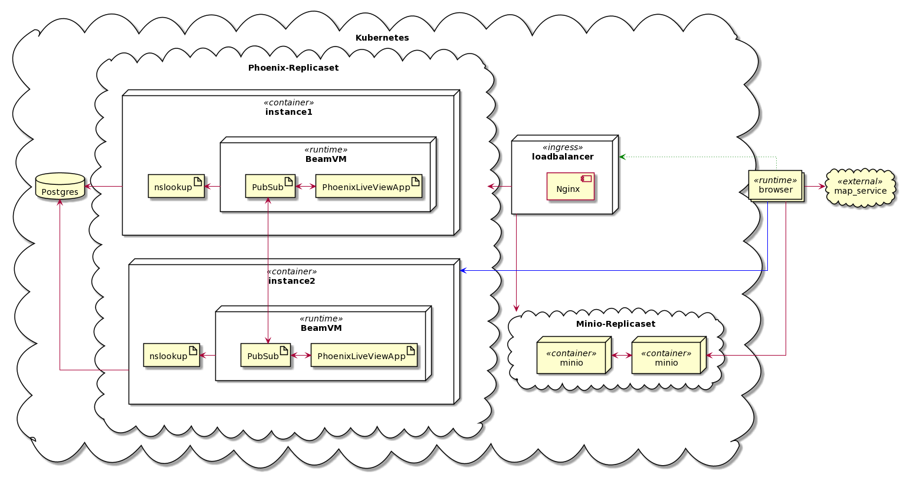
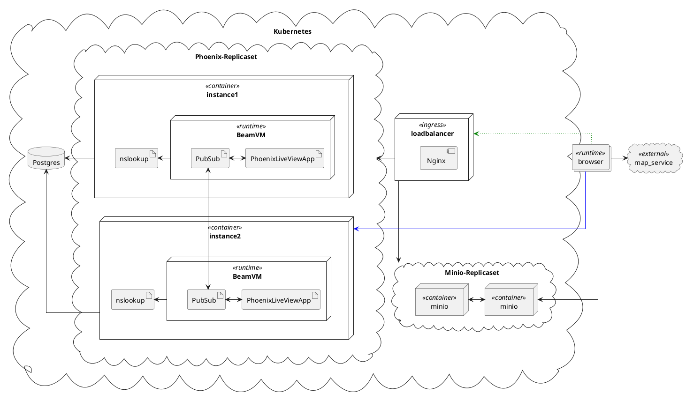

# Infrastructure Architecture

Dit hoofdstuk beschrijft welke hardware er gebruikt wordt om de applicatie te draaien. In de context van dit project zal
dit alleen virtuele hardware betrekken.

## Deployment diagram

Het onderstaande diagram geeft de uiteindelijke keuze weer over de infrastructuur, de keuze hiertoe wordt verderop
toegelicht.

Image preview

In dit diagram zijn blauwe lijnen websockets (channels) en groen gestippelde lijnen zijn http verbinding om een
instantie te kiezen. Nodes die in een wolkje zijn getekend zijn bij te schalen.

## Overwegingen

Omdat OutdoorDWA een grote piekbelasting moet aankunnen, is er veel op horizontale schaalbaarheid ingezet. Alles binnen
het project draait in docker containers, zodat het onafhankelijk van onderliggende systemen blijft. Kubernetes kan dit
schalen automatiseren.

Zoals het diagram laat zien zijn er twee subsystemen die schaalbaar zijn opgezet, namelijk de minio service en de
phoenix service.

### Phoenix

Om aan de applicatie kant een grote schaalbaarheid te bereiken is er gekozen voor Elixir met het phoenix framework, dit
staat erom bekend dat
het [vele verbindingen per server](https://www.phoenixframework.org/blog/the-road-to-2-million-websocket-connections)
aankan. Om dit ook met kleinere servers goed te laten schalen wordt er gebruik gemaakt van Phoenix PubSub, op deze
manier kunnen clients gesynchroniseerd blijven met elkaar, terwijl ze zijn verbonden met verschillende servers, zo
kunnen er dus meer servers worden gebruikt om de load te delen. Hiervoor moeten de phoenix instanties elkaar kunnen
vinden, dat gebeurt door het resultaat van [nslookup](https://www.computerhope.com/unix/unslooku.htm) te verwerken
met [Distributed Erlang](https://erlang.org/doc/reference_manual/distributed.html).

### Object storage

De keuze voor minio is afhankelijk van de verwachting dat file uploads en downloads het grootste deel van de totale load
zullen omslaan. Door gebruik te maken van minio worden de file uploads en downloads niet op hetzelfde systeem als de
rest van de applicatie afgehandeld, wat voor een betere distributie van de totale load zorgt. Een alternatief hiervoor
had MongoDB GridFS kunnen zijn, maar vanwege beperkte beschikbaarheid van library support voor Elixir is hier niet voor
gekozen. Verder lijkt GridFS een verhoogde complexiteit met zich mee te dragen en kon er geen argument worden gevonden
waarom GridFS beter zou zijn dan minio voor deze toepassing. Een andere reden om voor minio te kiezen is dat minio
ondersteuning levert om direct vanaf de client bestanden te up- en downloaden.

## Beperkingen

Er moet nog gekeken worden naar de availability van de loadbalancers, op dit moment draait nginx als ingress voor Kubernetes,
hiervan is voor ons nog niet bekend hoe failovers worden geregeld. Dit levert het risico op dat als de loadbalancer down
gaat de hele applicatie niet te gebruiken is. Dit kan mogelijk worden verholpen door meerdere nginx containers op te
starten met [keepalived](https://www.keepalived.org/). Met keepalived wordt het IP adres doorgegeven tussen de nginx
instanties, wanneer een instantie down gaat, blijft het IP-address bij een andere instantie.
