Dit hoofdstuk biedt instructies voor het deployen van OutdoorDwa op diverse manieren die relevant zijn voor nieuwe
developers.

### Voor development

1. start een lokale [postgres](https://www.postgresql.org/) instantie (of met
   docker `docker run -v postgresdata_phoenix:/var/lib/postgresql/data -p 5432:5432 -e POSTGRES_PASSWORD=postgres -d postgres`
   , of als docker-compose is opgezet zoals [hieronder](./11-deployment.md#voor-testen) beschreven `docker-compose --env-file=.env up db`)
2. zorg ervoor dat er een gebruiker is met gebruikersnaam `postgres` en wachtwoord `postgres`
3. open een terminal en navigeer naar `outdoor_dwa_umbrella/apps/outdoor_dwa`
4. voer het volgende command uit om de dependencies te installeren: `mix deps.get`
5. voer het volgende command uit om de database met standaard waardes te vullen: `mix ecto.reset`
6. start de applicatie `mix phx.server`
### Voor testen

1. installeer [docker](https://www.docker.com/) en [docker-compose](https://docs.docker.com/compose/).
2. open een terminal en navigeer naar `outdoor_dwa_umbrella`
3. kopieer `.env.example` naar `.env` (`cp .env.example .env`) en pas de waarden aan zoals gewenst voor de installatie.
4. voer het volgende command uit om de applicatie, minio en de database te starten `docker-compose --env-file=.env up`
    1. *Tip:* Maak een alias een in `~/.bashrc` of vergelijkbaar bestand, zodat je de .env-file niet
       vergeet `echo "alias dce='docker-compose --env-file=.env'" >> ~/.bashrc`. Reload hierna je
       terminal `source ~/.bashrc`. Met deze alias kun je `dce` gebruiken in plaats van `docker-compose --env-file=.env`.

### Voor productie

1. Installeer een lokaal kubernetes cluster met bijvoorbeeld [minikube](https://kubernetes.io/docs/tasks/tools/). De
   komende instructies gaan uit van minikube, bij een andere kubernetes installatie zullen een aantal van deze
   instructies afwijken.
2. open een terminal en navigeer naar `outdoor_dwa_umbrella`
3. start minikube met een vm driver
   <details>
    <summary>Linux</summary>
    <ol>
        <li>Installeer KVM2 voor de specifieke linux distributie (<a href="https://gist.github.com/grugnog/caa118205ad498423266f26150a5d555">Getest op Manjaro</a>)</li>
        <li><pre>minikube start --vm=true --driver=kvm2</pre></li>
    </ol>
   </details>
   <details>
    <summary>MacOS</summary>
    <pre>minikube start --vm=true --driver=hyperkit</pre>
   </details>
   <details>
    <summary>Windows</summary>
    <i>ongetest</i>
    <pre>minikube start --vm=true --driver=hyperv</pre>
   </details>
4. stel ingress beschikbaar voor loadbalancing: `minikube addons enable ingress`
5. laad minikube docker context `eval $(minikube docker-env)`
6. kopieer `.env.example` naar `.env` (`cp .env.example .env`) en pas de waarden aan zoals gewenst voor de installatie.
7. build de docker images met `docker-compose --env-file=.env build`
8. deploy de stack: `kubectl apply -f outdoor_dwa_k8s.yml`
9. start het dashboard: `minikube dashboard`
10. haal het docker ip op: `minikube ip`
11. voeg onderstaande aan je host file toe(vervang 192.168.64.3 met het resultaat van `minikube ip`):
```tsv
192.168.64.3    dwa-outdoor.test
192.168.64.3    file.dwa-outdoor.test
```
*Let op:* Wanneer je `minikube delete` draait kunnen de ip adressen anders zijn wanneer deze stappen opnieuw worden
doorlopen.

## In productie draaien met Rancher
Bij het draaien van de applicatie in kubernetes kan er gekozen worden tussen unmanaged(zoals [kubeadmn](https://kubernetes.io/docs/setup/production-environment/tools/kubeadm/create-cluster-kubeadm/) of [kind](https://kind.sigs.k8s.io/docs/user/quick-start/)) en managed(zoals [EKS](https://aws.amazon.com/eks/), [AKS](https://azure.microsoft.com/en-us/services/kubernetes-service/)) kubernetes.

Bij managed kubernetes wordt het cluster beheerd door een andere partij zoals Amazon of Azure. Op een managed platform worden security patches automatisch geïnstalleerd en wordt ervoor gezorgd dat kubernetes (waaronder [control plane](https://kubernetes.io/docs/concepts/overview/components/)) de laatste updates krijgt.

Dit zorgt ervoor dat de afnemer(developer/devops) zijn tijd kan besteden aan het draaien van applicatie en weinig tot geen tijd hoeft te besteden aan het onderhouden en beheren van een cluster.

Terwijl managed kubernetes voor minder beheer tijd zorgt, zitten hier ook kosten aan verbonden. Om kosten te besparen kan er gekozen worden om zelf het kubernetes cluster te beheren. Een van de platforms die dit mogelijk maakt is [Rancher](https://rancher.com/).

Rancher maakt het mogelijk om een groot kubernetes cluster bestaande uit een of meerdere master-node en meerdere worker nodes te beheren en op te delen. Zo kunnen er projecten en namespaces gemaakt worden waar alleen specifieke gebruikers toegang tot hebben.

Per project kan ook precies ingesteld worden hoeveel resources er beschikbaar zijn. Hierdoor kunnen resources over bijvoorbeeld verschillende groepen worden verdeeld, hierdoor wordt voorkomen dat een enkele groep alle resources gebruikt waardoor de rest niet verder kan.

Naast het beheren van resources kan er globale configuratie van bijvoorbeeld standaard docker registry's of logging worden ingesteld. Hierdoor kan alles op een enkele plek worden beheerd en is dit meteen toegepast voor alle groepen.

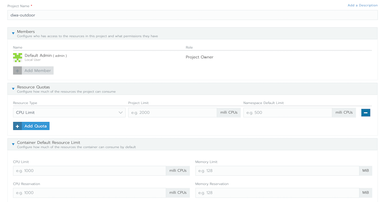

### Managed kubernetes met rancher
#### Kubernetes opzet
Het DwaOutdoor project is in de basis al opgezet als [docker-compose](https://docs.docker.com/compose/) project, op basis hiervan is een kubernetes project definitie bestand opgezet(`outdoor-dwa_k8s.yml`) en deze is lokaal getest via [minikube](https://minikube.sigs.k8s.io/docs/start/).

In dit kubernetes yml(`outdoor_dwa_k8s.yml`) bestand is volledig beschreven wat er nodig is om de applicatie te draaien. In dit yml bestand wordt er gebruik gemaak van docker images references die verwijzen naar een private docker registry(zoals: `ghcr.io/erikknaake/dwa-outdoor/dwa-outdoor-app`). Voor dit project is er voor [Github Packages](https://github.com/features/packages) gekozen omdat deze een nauwe integratie heeft met de releases op het github project. 

Zo is er al een standaard oplossing vanuit [Github Actions](https://github.com/features/actions) (CI/CD van Github) om docker images op Github builden en te pushen naar de Github private docker registry. Om de applicatie te kunnen deployen moeten credentials worden ingericht die lees rechten hebben tot de packages. Dit kan worden gedaan door te controleren of het huidige account toegang heeft tot de [dwa ica docker registry](https://github.com/orgs/HANICA-DWA/packages/).

Als het account deze pagina kan benaderen kan er een access token worden aangemaakt met `packages:read` rechten, dit staat verder toegelicht in de [Github documentatie](https://docs.github.com/en/free-pro-team@latest/github/authenticating-to-github/creating-a-personal-access-token). Dit account kan dan door kubernetes worden gebruikt bij het ophalen van de docker images.

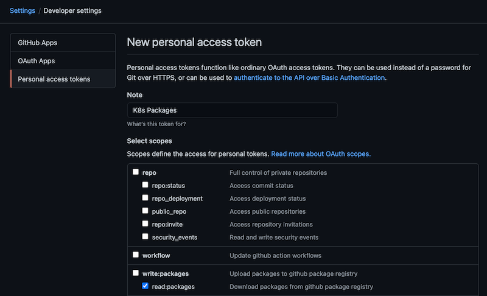

Na het inrichten van dit account kan het project worden gedeployed met `kubectl apply -f outdoor_dwa_k8s.yml`. Dit maakt de `dwa-outdoor` namespace aan en start de applicaties met databases. Om ervoor te zorgen dat kubernetes bij de images kan, kan een secret worden aangemaakt:
```shell
kubectl create secret docker-registry packages --docker-server=https://ghcr.io/v2/ --docker-username=ENTER_GITHUB_USERNAME_HERE --docker-password=TOKEN_WITH_PACKAGES_READ --docker-email=ENTER_GITHUB_USERNAME_HERE -n outdoor-dwa
```

Na het starten kan de host-file worden aangepast om via DNS het cluster te benaderen. Om dit in te stellen hebben we het cluster ip nodig, bij minikube kan dit opgehaald worden met `minikube ip`. Dit IP kan aan de host-file worden toegevoegd zoals onderstaand voorbeeld:
```
> /etc/hosts
192.168.64.3    dwa-outdoor.test
192.168.64.3    file.dwa-outdoor.test
```

#### Rancher inrichten
Rancher levert standaard een web-interface mee waarmee het kubernetes cluster geconfigureerd kan worden. Voor het lokaal testen draaien we rancher in een docker container, aan deze docker container wordt ook een docker volume gekoppeld zodat bij een herstart de inrichting bewaard blijft:
```shell
docker run -d --privileged -p 8080:80 -p 4443:443 -v rancherdata:/var/lib/rancher rancher/rancher
```

Bij het voor het eerst inloggen kan een admin account worden aangemaakt. Na het inloggen is de eerste stap van het inrichten van OutdoorDwa het aanmaken van een project en namespace. Hierin zullen alle project specifieke instellingen worden geconfigureerd.

Het aanmaken van een project kan worden gedaan door een node te kiezen en naar de Projects/Namespaces pagina te gaan:

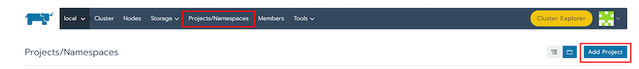

Na het aanmaken van een project genaamd `dwa-outdoor` kan daarbinnen een namespace met dezelfde naam worden aangemaakt. De standaard opties kunnen gebruikt worden bij het aanmaken van de namespace.

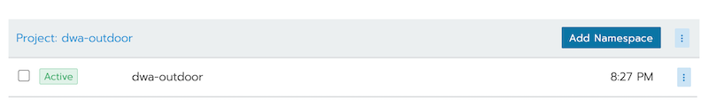

Omdat er in ons kubernetes project gebruik wordt gemaakt van de private docker registry van [Github packages](https://github.com/features/packages) moet het cluster toegang krijgen tot deze registry. Rancher heeft hier standaard ondersteuning voor. Dit kan ingesteld worden via het `Resources > Secrets menu`:

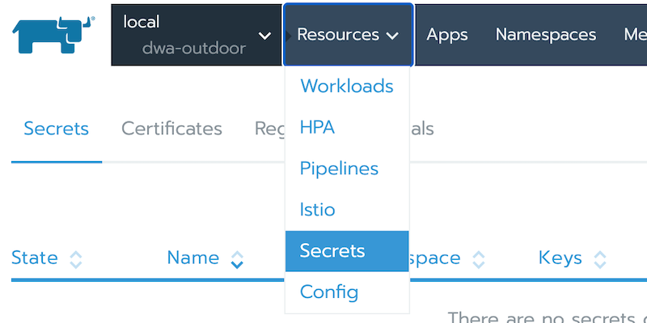

Kies dan voor het `Registry Credentials` tabje, en klik op de `Add Registry` knop. Voeg hier de username en token van het account met `packages:read` toe die eerder op Github is ingericht. Naast het invullen van de login gegevens moet er voor de `Custom` optie gekozen worden waar `ghrc.io/v2/` ingevuld moet worden.

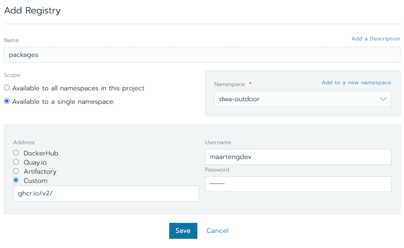

Open dan weer de start-pagina van het `dwa-outdoor` project en kies bij een Workloads tabje de `Import YAML` optie. Hier kunnen we eerder gemaakte kubernetes yml importeren om de applicatie te starten.

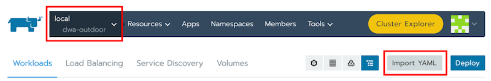

Plak hier de inhoud uit `outdoor_dwa_k8s_rancher.yml` in, en kies voor importeren in `dwa-outdoor` namespace:

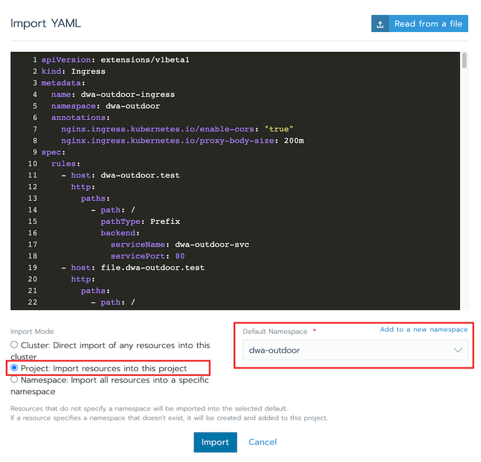

De services zullen nu met bijhorende status in het overzicht getoond worden.

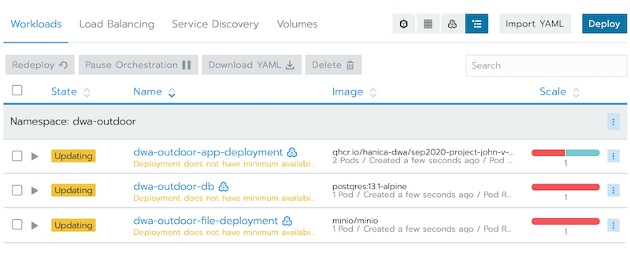

Ook is de ingress(Load balancer) aangemaakt.

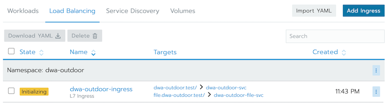

Voeg dan het IP van de node toe aan de host-file:
```
> /etc/hosts
192.168.64.3    dwa-outdoor.test
192.168.64.3    file.dwa-outdoor.test
```

De applicatie is nu volledig beschikbaar via de domein namen:

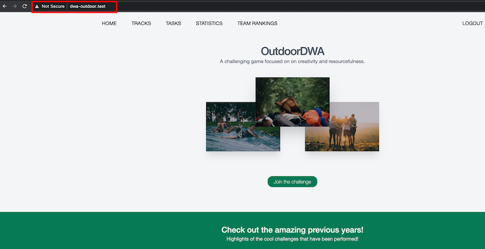

Ook is deze nu te monitoren door de Cluster Explorer te openen:

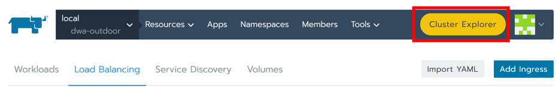

en daar de `outdoor-dwa` namespace te kiezen:

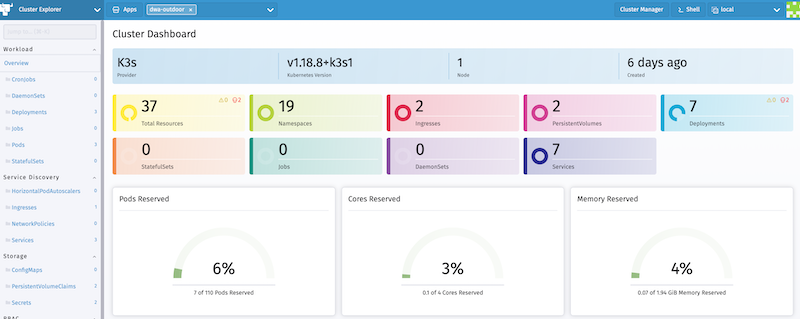

De applicatie is nu volledig ingericht op rancher.