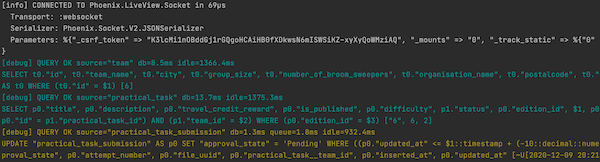

In dit hoofdstuk worden de belangrijkste technologische keuzes en architecturele keuzes die gemaakt zijn beschreven. Voor elke keuze is beschreven wat de keuze en alternatieven zijn. Waarom voor een bepaalde technologie of framework gekozen is en hoe hiervoor gekozen is.

## Data persistence

### Database engine

Als database engine is gekozen voor PostgreSQL. Andere opties die overwogen zijn, zijn MSSQL en MongoDB. Phoenix gebruikt Ecto om te communiceren met de database. Ecto maakt het mogelijk in Elixir code data te mappen en queries te schrijven. Er is gekozen voor PostgreSQL, omdat Ecto veel mogelijkheden biedt voor het werken met SQL databases. Daarnaast is PostgreSQL de standaard database engine die Ecto gebruikt.

Ecto geeft de mogelijkheid om in Elixir code schema's te definiëren, met foreign key relaties die overeenkomen met de relationele tabellen in een PostgreSQL database. Ook biedt Ecto in combinatie met PostgreSQL de mogelijkheid om op een makkelijke manier d.m.v. deze schema's constraints te valideren bij het manipuleren van data. Daarnaast geeft Ecto bij SQL databases de mogelijkheid om de database in de loop van de tijd te veranderen met database migraties. MongoDB is overwogen, maar wordt niet standaard ondersteund door Ecto. Hier moet eerst een adapter voor worden toegepast om Ecto en MongoDB samen te laten werken. Daarnaast vallen een aantal voordelen van Ecto weg bij het gebruik van MongoDB.

## User interface

### Front-end library

Als front-end library zijn Phoenix LiveView en React overwogen. De keuze is gevallen op Phoenix LiveView. LiveView is gebouwd op de structuur van Phoenix en daardoor makkelijk in gebruik te nemen. Een applicatie opzetten met React en Phoenix vereist daarentegen meer werk. Daarnaast geeft LiveView de mogelijkheid om interactiviteit toe te voegen aan de applicatie zonder hiervoor allemaal Javascript structuren op te zetten. LiveView maakt gebruik van server-side rendering, hierdoor hoeft de app niet opgesplitst te worden in een front-end en back-end die met elkaar communiceren d.m.v. een API, wat bij React wel moet gebeuren.

## Deployment

De applicatie wordt in de verschillende fasen van het ontwikkel traject op verschillende manieren gedraaid. Zo wordt tijdens het ontwikkelen de software direct op het systeem gedraaid en wordt de applicatie als docker container in kubernetes voor productie gedraaid. Voor elk van de stappen in het ontwikkeld proces is toegelicht waarom er voor deze opzet is gekozen.

### Development

Tijdens het ontwikkelen is het essentieel om snel feedback te krijgen op de gemaakte wijzigingen en dingen die mislopen. De focus ligt dus op de DX([Developer experience](https://css-tricks.com/what-is-developer-experience-dx/)). Zo moeten wijzigingen zo snel mogelijk beschikbaar zijn via [hot-reloading](https://github.com/phoenixframework/phoenix_live_reload) en automatische pagina refreshes bij wijzigingen.

Om dit mogelijk te maken is er gekozen om de ingebouwde phoenix server te gebruiken(`mix phx.server`), deze levert standaard hot-reloading mee en maakt logs inzichtelijk:



### Test

Voor het testen van de applicatie, zoals de load testen wordt [docker-compose](https://docs.docker.com/compose/) gebruikt. Met docker-compose kan er met een enkel command verschillende containers opgetuigd worden(`docker-compose up`), dit command bouwt de containers zo nodig en start ze daarna.

Om de applicatie in docker-compose te draaien zijn er verschillende docker files opgesteld die beschrijven hoe de applicatie gebouwd en gedraaid kan worden. Naast het draaien van containers versimpeld docker-compose ook de afhankelijkheden en integratie tussen containers. Zo is het mogelijk om met [depends_on](https://docs.docker.com/compose/compose-file/#depends_on) te wachten tot andere containers zijn gestart. Zo zorgen we ervoor dat de applicatie pas wordt gestart als de database beschikbaar is. Dit verhelpt zo genoemde race-condities.

Naast het afstemmen van opstart volgorde helpt docker-compose ook met het verbinding zoeken met andere containers. Elk van de containers opgezet via docker-compose kunnen elkaar namelijk vinden bij naam via een [docker netwerk](https://docs.docker.com/compose/networking/). Zo kan de applicatie server de database vinden bij simpelweg `db` via DNS te benaderen en docker regelt het omzetten van naam naar container.

### Productie

Door de applicatie, database en bestand-opslag al in docker containers te hebben gestopt voor betere isolatie(voor security en minder externe afhankelijkheden) is de volgende stap naar opzetten van een schaalbaar platform een snel haalbare stap.

Doordat de applicatie geen sterke platform afhankelijkheden heeft(zoals java moet geinstalleerd zijn) en stateless is ingericht kan deze gemakkelijk over verschillende machines beschikbaar worden gesteld. Hierdoor kan de applicatie opschalen van 2 tot 6 instanties zonder dat een eindgebruiker dit merkt, zo blijft het platform zelfs goed werken bij piek-belasting.

Dit probleemloos schalen wordt mogelijk gemaakt door [kubernetes](https://kubernetes.io/), dit is een zogenoemd container orchestrator platform. Een orchestrator regeld het starten, stoppen en bijhouden van containers. Als beheerder hoef je niet bezig te houden met hoe dit wordt gedaan omdat je aan kubernetes alleen het gewenste scenario verteld.

Zo kan je bijvoorbeeld aangeven dat je altijd 4 instanties van de applicatie wil draaien en 2 keer de bestand-opslag service, dit gewenste scenario wordt omschreven in een yaml bestand, dit yaml bestand wordt uitgelezen door het [Control Plane](https://kubernetes.io/docs/concepts/overview/components/#control-plane-components) onderdeel van Kubernetes. Dit control plane component houd de containers in de gaten en start bijvoorbeeld een container als er eentje uitvalt. Een voorbeeld yaml bestand is hieronder uitgewerkt:

```yaml
apiVersion: apps/v1
kind: Deployment
metadata:
  name: outdoor-dwa-file-deployment
  namespace: outdoor-dwa
  labels:
    app: outdoor-dwa-file
    tier: file
spec:
  replicas: 3
  selector:
    matchLabels:
      app: outdoor-dwa-file
      tier: file
  template:
    metadata:
      labels:
        app: outdoor-dwa-file
        tier: file
    spec:
      containers:
        - name: outdoor-dwa-file
          image: minio/minio
          command: ['/usr/bin/minio']
          args: ['server', '/data']
```

Naast het van te voren definieren van het gewenste aantal instanties kan kubernetes ook zelf instanties bij schalen waar nodig met [autoscaling](https://kubernetes.io/docs/tasks/run-application/horizontal-pod-autoscale/). Dit kan worden gedaan op basis van bijvoorbeeld het huidige CPU of RAM gebruikt, zo kun je instellen dat als de CPU load van alle applicatie containers hoger is dan 60% automatisch een extra container wordt gestart. Een voorbeeld scaling rule is hieronder uitgewerkt:

```yaml
type: ContainerResource
containerResource:
  name: cpu
  container: application
  target:
    type: Utilization
    averageUtilization: 60
```
## Container orchestration
Tijdens het ontwikkelen kunnen Docker containers door ontwikkelaars gemakkelijk gestart en gestopt kan worden. Als er wat mis gaat kan de ontwikkelaar de container zelf inspecteren of opnieuw opstarten.

Bij het draaien in productie is dit geen schaalbare oplossing, er moet een systeem aanwezig zijn die de containers in de gaten houdt. Dit systeem moet zelf containers kunnen starten en stoppen om ervoor te zorgen dat altijd het juiste aantal containers beschikbaar is.  

Per fase van het [OTAP](https://www.acc-ict.com/de-otap-ontwikkelstraat-vier-fases/) proces is er een container orchestrator gekozen, voor ontwikkelen is dit [Docker Compose](https://docs.docker.com/compose/), voor productie wordt er [kubernetes](https://kubernetes.io/) binnen [Rancher](https://rancher.com/) gebruikt.  

Er is in productie voor Rancher gekozen omdat hiermee op een centrale plek instellingen zoals [Private Container Registry's](https://github.com/features/packages) en [RBAC](https://kubernetes.io/docs/reference/access-authn-authz/rbac/) ingesteld kunnen worden. Deze [configuratie](https://rancher.com/docs/os/v1.x/en/configuration/) kan gedeeld worden over meerdere projecten waardoor er weinig tot geen dubbele configuratie is. Ook kunnen resources(CPU/memory) worden verdeeld over meerder projecten, door harde limieten in te stellen kan een enkel project met een enorme belastig er niet voor zorgen dat andere projecten onbeschikbaar worden.

Bij het opstellen van het kubernetes definitie bestand is er voor gezorgd dat deze platform en vendor on-afhankelijk is(om [Vendor Lock-In](https://www.cloudflare.com/learning/cloud/what-is-vendor-lock-in/) te voorkomen). Dit hebben we bereikt door geen resource types te gebruiken die alleen in bijvoorbeeld Azure of AWS beschikbaar zijn.

Terwijl we het kubernetes cluster nu via Rancher beheren kan het definitie bestand(`outdoor_dwa_k8s.yml`) ook voor verschillende managed platforms zoals [AKS](https://docs.microsoft.com/en-us/azure/aks/) en [EKS](https://aws.amazon.com/eks/) gebruikt worden. 

## Object storage

Zie toelichting in het hoofdstuk [infrastructure architecture](./10-infrastructure-architecture.md#object-storage)

## Pdf Library

Voor PDF library is er gekozen voor [PDF](https://hexdocs.pm/pdf/Pdf.html). Het genereren van PDF's met de doe-opdrachten is geen essentieel onderdeel van de applicatie, en daarom is hier niet te lang stilgestaan bij de verschillende libraries. Er is uiteindelijk voor de PDF library gekozen, omdat deze met enkel één dependency direct werkt. Bij de twee onderstaande alternatieven moest er eerst tijd en moeite gestopt worden in het installeren van de libraries, en hier was geen behoefte aan.

Andere alternatieven voor PDF-libraries zijn:

- [PuppeteerPdf](https://hexdocs.pm/puppeteer_pdf/readme.html)
- [PdfGenerator](https://hexdocs.pm/pdf_generator/api-reference.html)

PdfGenerator gebruikt wkhtmltopdf of headless chrome om een PDF te genereren vanuit html, en Puppeteer enkel headless chrome. Voordelen hiervan zijn dat de geschreven HTML (deels) bruikbaar is.

Een nadeel van beide opties is een extra dependency op WkHtmlToPdf, of headless chrome. Een chrome image neemt al snel minstens 90 MB opslagruimte in beslag, wat snel oploopt bij het horizontaal schalen van de applicatie.

## MapBox

Voor het tonen van interactieve kaarten in de browser waarop gebruikers antwoorden kunnen geven is gekozen voor de [MapBox GL JavaScript library](https://docs.mapbox.com/mapbox-gl-js/api/). Er is ook overwogen om de [Google Maps JavaScript library](https://developers.google.com/maps/documentation/javascript/overview) te gebruiken. Er is voor MapBox gekozen omdat het goedkoper is en omdat voor MapBox geen geldige betaalmethode vereist om gratis te beginnen. MapBox voldoet ook goed aan de verwachtingen omdat gebruikers plaatsen of polygons op de kaart kunnen selecteren, en daarvan de lengte en breedtegraad(en) opgeslagen kunnen worden. Vervolgens kunnen de eerder geselecteerde plaatsen of polygons later weer getoond worden op de kaart.

## Countdown.js

Voor het tonen van de timers is gekozen voor [Countdown.js](http://countdownjs.org). Dat is een basic open source JavaScript API. Er is gekozen voor deze library omdat het veel tijd bespaart vergeleken met het zelf ontwikkelen van een betrouwbare countdown. Het is ook niet voor de handliggend om de timer server side in Elixir te ontwikkelen omdat dat voor heel veel onnodige communicatie zorgt tussen de client en de server. Dat komt de snelheid en daarmee ervaring niet tegemoet. Het kan namelijk voorkomen dat als Phoenix het broadcasten van de timers iedere seconde niet meer bij kan houden, andere updates ook niet doorkomen. De timer werkt dan vertraagd en andere mogelijk belangrijkere updates komen dan ook niet op tijd door.
