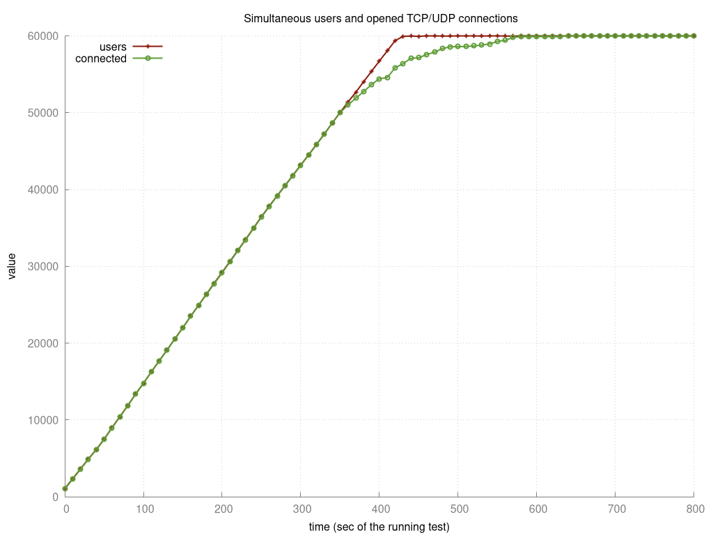
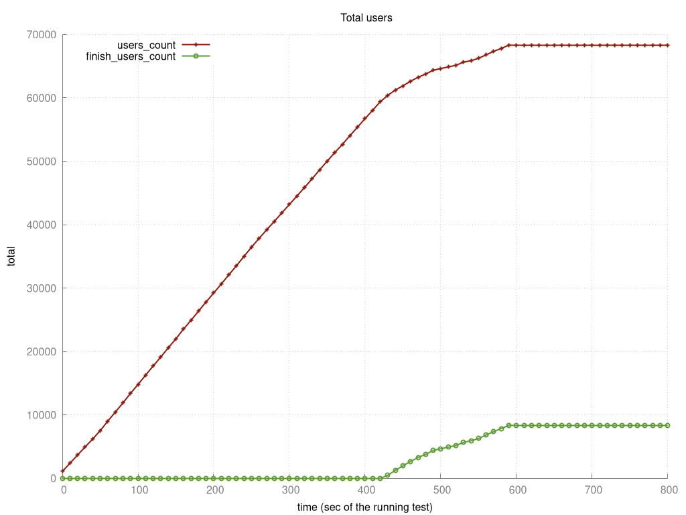
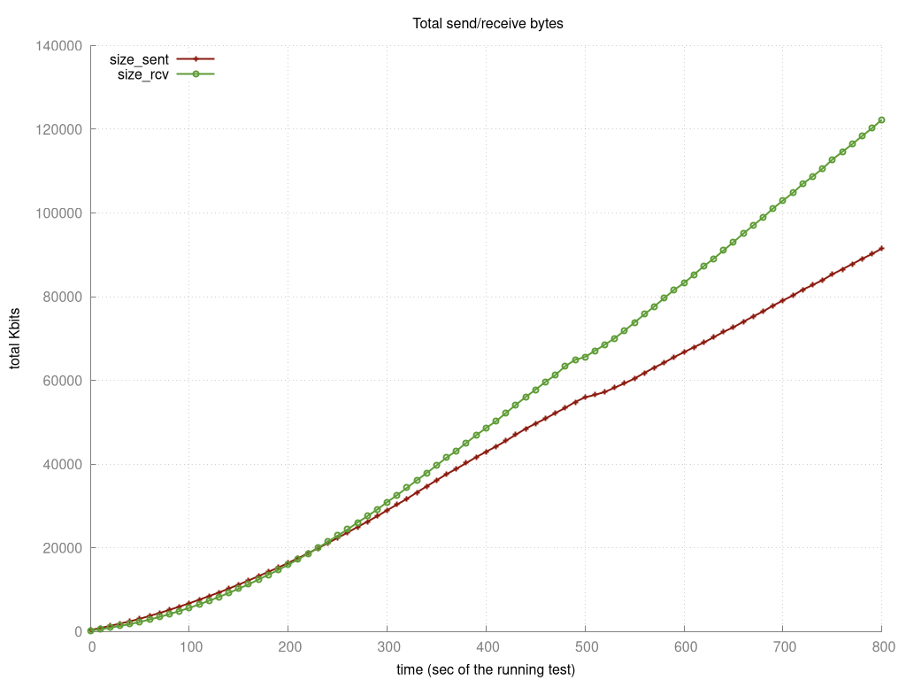
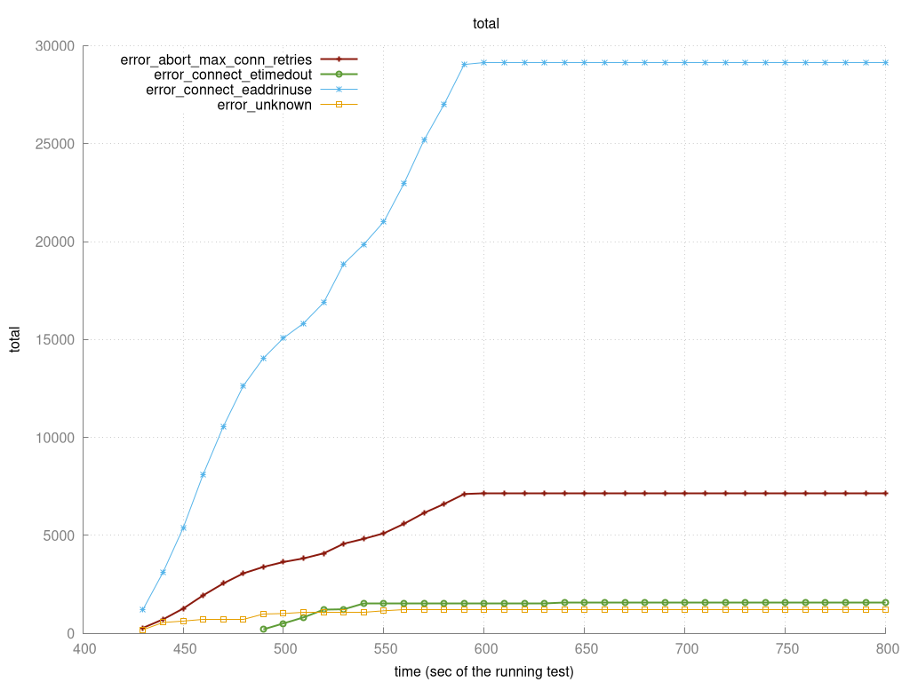

# Load tests

## Test methode

### Infrastructuur

De target server en de load generator zijn verbonden door een 1 Gbit/s ethernet verbinding op een netwerk zonder andere
apparaten.

#### Target

- Ubuntu Server 20.04
- openssh-server
- docker-compose
- 4 GB DDR2 RAM (+- 2.3 GB vrij met server zonder gebruikers)
- 1 CPU @ 1.8 GHz
- 128 GB storage

#### Load generator

- Manjaro
- ssh
- [tsung](http://tsung.erlang-projects.org/user_manual/installation.html) version 1.7.0
- 12 GB DDR3L RAM (+- 9 GB vrij)
- 4 CPU @ 2.8-3.2 GHz
- 128 GB storage

### Methode

Zowel op de target als op de loadgenerator wordt de ulimit aangepast om 100000 file descriptors aan te
kunnen (`ulimit -n 100000`)
Op de loadgenerator is de portrange aangepast naar 1025-60999 (`/proc/sys/net/ipv4/ip_local_port_range`)
Tijdens elke tests verbind te loadgenerator met ssh op de target server om `top` te draaien, op deze manier kan worden
bekeken of werkgeheugen of CPU de limiet is.

#### Test scenarios

##### Idling users

In dit [scenario](./tsung-config-websocket-heartbeat.xml) wordt het aantal concurrent websocket connection getest, waarbij alle connecties elke 15 seconden een
heartbeat sturen. Deze test is uitgevoerd met een arrivalrate van 150 gedurende 10 minuten.

###### Resultaten

De volgende grafieken laten zien dat tot ongeveer 50.000 gebruikers de connectie tijd lineair blijft, hierna zie je dat
de target resources richting hun limiet zitten en dat er minder snel connecties opgezet kunnen worden.

De volgende grafiek laat zien dat netwerk brandbreedte geen rol heeft gespeeld, en dat zoals verwacht het aantal
heartbeats blijft toenemen.

Zoals in de volgende grafiek te zien is, kon de loadgenerator richting het einde van de test geen nieuwe verbindingen
meer openen, omdat het geen poorten meer beschikbaar had. Daarnaast is te zien dat er rond hetzelfde moment timeouts
begonnen plaats te vinden.

*Let op:* tijd as begint bij 400 seconden

Deze test heeft ook de limieten van het target behaald, de CPU hiervan zat rond de 95% en minder dan 180 MB RAM over
richting het eind.

### Flaws

Deze tests zijn niet 100% representatief, in een werkelijke productieomgeving zullen er meer en veel krachtigere servers
worden gebruikt.